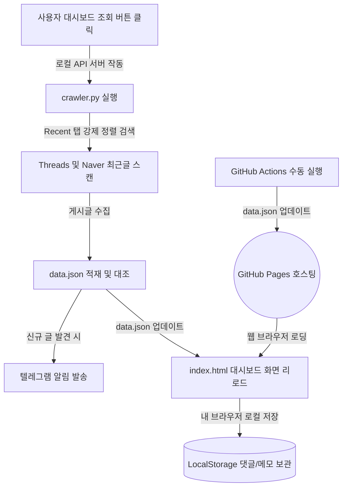

# 🏡 제주여행 SNS & 블로그 통합 모니터링 시스템

로컬 웹 서버 환경에서 실시간 조회가 가능하며, **깃허브 페이지(GitHub Pages)** 정적 웹 호스팅 서비스상에서 동작하는 웹 대시보드 모니터링 시스템입니다. 
대시보드 상에서 **[실시간 수집 및 조회]** 버튼을 누르거나 **깃허브 액션(GitHub Actions)**의 수동 실행 트리거를 통해 필요한 순간 즉석에서 최신 글을 수집하여 업데이트하고 텔레그램 알림을 발송합니다.

---

## 1. 시스템 아키텍처 (전체 구조)



### 핵심 장점
- **실시간 맞춤 조회**: 30분 주기 자동 백그라운드 크롤링 대신, 사용자가 [조회]를 실행하는 시점의 최신 게시물을 실시간으로 스크래핑해 오므로 가장 신선한 데이터를 조회할 수 있습니다.
- **서버 비용 0원 & 정적 배포**: 깃허브에서 제공하는 무료 호스팅(Pages)을 사용해 비용 없이 구동됩니다.
- **계정 100% 안전 보장**: 대시보드에서 댓글을 작성하면 자동으로 텍스트가 복사되고 해당 글로 순간 이동하는 **RPA 클립보드 매핑**을 통해 봇 탐지 계정 정지 위험을 완벽 차단합니다.

---

## 2. 깃허브 저장소(Repository) 구성 및 설정 상세 가이드

본 자동화 시스템을 정상적으로 서비스하려면 본인의 GitHub 계정에 다음 세팅을 순서대로 진행해 주셔야 합니다.

### 1단계: 깃허브 저장소(Repository) 생성 및 코드 푸시
1. [GitHub](https://github.com/)에 로그인한 뒤 **New Repository**를 생성합니다.
   - *주의: 저장소는 반드시 **Public(공개)**으로 생성하셔야 무료로 GitHub Pages를 켤 수 있습니다.*
2. 본 폴더(`c:\Users\조지수\.gemini\sns`) 내의 모든 파일을 생성한 깃허브 저장소에 푸시(업로드)합니다.

### 2단계: GitHub Secrets 보안 환경 변수 등록
수집기가 돌아갈 때 필요한 비밀번호와 키(텔레그램, 네이버 API 등)를 깃허브 서버에 안전하게 등록합니다.
1. 내 깃허브 저장소 페이지 상단의 **Settings** 탭으로 이동합니다.
2. 좌측 메뉴에서 **Secrets and variables -> Actions**를 클릭합니다.
3. **New repository secret** 버튼을 눌러 아래 변수들을 각각 등록해 줍니다.

| Secret 이름 | 설명 / 기입할 값 |
| :--- | :--- |
| `TELEGRAM_BOT_TOKEN` | 텔레그램 `@BotFather`에게 발급받은 봇 HTTP API 토큰 |
| `TELEGRAM_CHAT_ID` | 내 알림을 수신할 텔레그램 사용자 숫자 ID |
| `SEARCH_KEYWORDS` | 검색할 키워드 (예: `제주여행` 또는 `비로소433`) |
| `NAVER_CLIENT_ID` | 네이버 개발자 센터에서 발급받은 Client ID (선택, 미등록 시 일반 스크래핑 우회) |
| `NAVER_CLIENT_SECRET`| 네이버 개발자 센터에서 발급받은 Client Secret (선택) |

### 3단계: GitHub Pages 웹서비스 활성화 (화면 주소 켜기)
1. 깃허브 저장소의 **Settings** 탭으로 이동합니다.
2. 좌측 메뉴에서 **Pages**를 클릭합니다.
3. **Build and deployment** 항목의 Source를 **Deploy from a branch**로 지정합니다.
4. Branch를 **`main`** (또는 `master`)로 설정하고 폴더를 `/ (root)`로 지정한 뒤 **Save**를 누릅니다.
5. 약 1분 뒤 페이지 상단에 배포된 고유의 웹 대시보드 주소가 활성화됩니다!
   - *예시 주소: `https://[본인아이디].github.io/[저장소이름]/`*

---

## 3. 웹 대시보드 주요 기능 및 화면 안내

- **실시간 피드 뷰**: 수집된 글들이 작성자 ID와 본문내용, 원본 바로가기 링크와 함께 플랫폼별(Threads는 올리브, Naver는 네이버그린) 테마 스타일 카드로 자동 나열됩니다.
- **댓글 및 메모 저장 (LocalStorage)**:
  - 각 카드 하단 **[💬 댓글 및 관리 메모]** 탭을 통해 메모를 기록하면 데이터가 본인의 웹 브라우저 로컬 저장소에 영구 보존됩니다.
- **세미 오토 RPA (클릭 앤 붙여넣기)**:
  - 메모가 작성된 말풍선 카드를 마우스로 **클릭**하면 작성한 코멘트 텍스트가 **컴퓨터 클립보드에 자동 복사**되면서 해당 포스트 원본창이 새 탭으로 연결됩니다.
  - 열린 창의 댓글창에 마우스 우클릭 후 **붙여넣기(Ctrl+V) -> 엔터**만 누르면 2초 만에 실제 댓글 업로드가 완료됩니다.
- **CSV 다운로드**: 수집 데이터를 한글 인코딩이 지원되는 엑셀용 CSV 파일로 즉시 내려받을 수 있습니다.

---

## 4. 로컬 테스트 및 개발용 명령어

Actions를 돌리지 않고 내 컴퓨터에서 스크립트를 즉시 수동 실행해 보고 싶다면 다음 명령어를 사용합니다.

```bash
# 1. 라이브러리 설치
pip install -r requirements.txt
playwright install chromium

# 2. 로컬 테스트용 .env 작성 후 크롤링 실행 (data.json 갱신 및 텔레그램 발송)
python crawler.py

# 3. 로컬에서 웹 대시보드 바로 켜기 (index.html 더블클릭 또는 로컬 웹서버 실행)
python -m http.server 8000
# 브라우저에서 http://localhost:8000 접속
```
